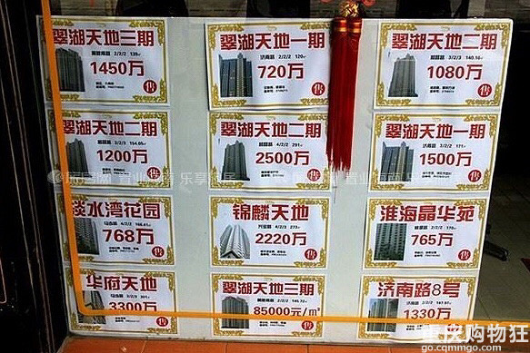

# 钱

钱呐！是比命还要珍贵的。

大部分人都是贫穷的，很有可能，我们这一辈子都赚不到一千万。

看一看上海高达一千万的房价吧！你这辈子，赚不到的钱，对别人而言，只是一栋房子而已。

钱呀，就是分散的权力！就是可以单次行驶的权力。例如一个人时薪是一百元，你的每张一百块，其实就是一种能力。命令他工作，而且是为你工作一个小时的能力！

仔细一想，我们的生活中大部分时间，不就是在——挣钱么！钱，就是生命，就能换来他人的时间，能通过请到更好的医生，延长自己的生命。

好啦，我们这个简单的小游戏还是不要这样严肃。但务必明确一点：

**没有钱——你就会死！**

